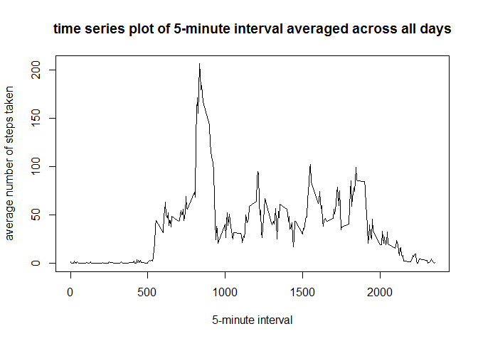

# Reproducible Research: Peer Assessment 1

## Loading and preprocessing the data


```r
## read the activity data frame
activity <- read.csv("activity.csv")
```

## What is mean total number of steps taken per day?

```r
## calculate steps per day
stepsPerDay <- aggregate(steps ~ date, data=activity, sum, na.action = na.omit)

## Make a histogram of the total number of steps taken each day
hist(stepsPerDay$steps, main="Total number of steps taken each day", 
                        xlab="Steps per day")
```

 

```r
## calculate mean of the total number of steps taken per day
mean(stepsPerDay$steps)
```

```
## [1] 10766.19
```

```r
## calculate median of the total number of steps taken per day
median(stepsPerDay$steps)
```

```
## [1] 10765
```

## What is the average daily activity pattern?

```r
## calculate average number of steps taken, averaged across all days
avg <- aggregate(steps ~ interval, data=activity, mean)

## time series plot of the 5-minute interval 
plot(avg$interval, avg$steps, type = "l",
     main = "time series plot of 5-minute interval averaged across all days",
     xlab = "5-minute interval",
     ylab = "average number of steps taken")
```

 

```r
## Get the name the 5-minute interval that has maximum number of steps
avg[avg$steps==max(avg$steps),1]
```

```
## [1] 835
```

## Imputing missing values


## Are there differences in activity patterns between weekdays and weekends?
