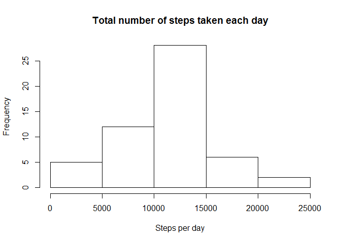
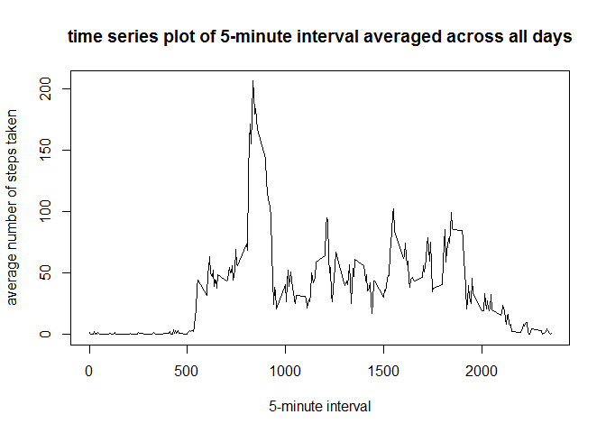
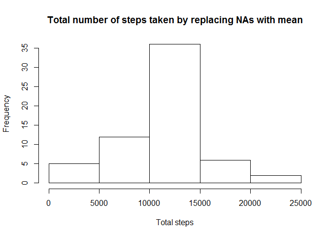
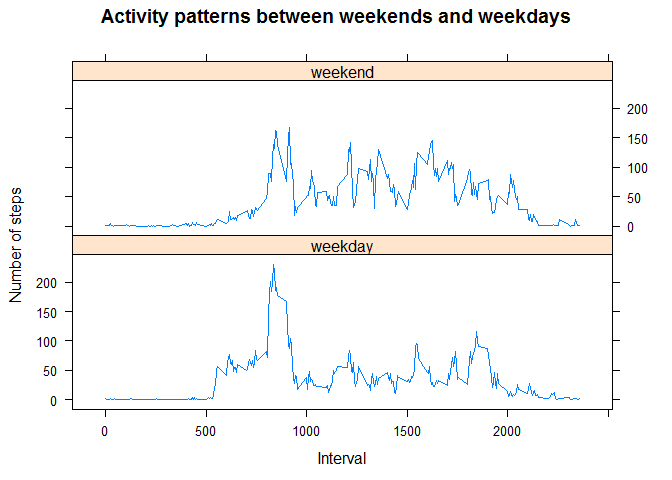

# Reproducible Research: Peer Assessment 1

## Loading and preprocessing the data


```r
## read the activity data frame
activity <- read.csv("activity.csv")
```

## What is mean total number of steps taken per day?

```r
## calculate steps per day
## the default action for aggregate is (na.action = na.omit) ignores NA values
stepsPerDay <- aggregate(steps ~ date, data=activity, sum)

## Make a histogram of the total number of steps taken each day
hist(stepsPerDay$steps, main="Total number of steps taken each day", 
                        xlab="Steps per day")
```

 

```r
## calculate mean of the total number of steps taken per day
mean(stepsPerDay$steps)
```

```
## [1] 10766.19
```

```r
## calculate median of the total number of steps taken per day
median(stepsPerDay$steps)
```

```
## [1] 10765
```
* The **mean** total number of steps taken per day 10766

## What is the average daily activity pattern?

```r
## calculate average number of steps taken, averaged across all days
avg <- aggregate(steps ~ interval, data=activity, mean)

## time series plot of the 5-minute interval 
plot(avg$interval, avg$steps, type = "l",
     main = "time series plot of 5-minute interval averaged across all days",
     xlab = "5-minute interval",
     ylab = "average number of steps taken")
```

 

```r
## Get the name the 5-minute interval that has maximum number of steps
avg[avg$steps==max(avg$steps),1]
```

```
## [1] 835
```
* The **name** of the 5-minute interval on average across all days is 835

## Imputing missing values

```r
## calculate the number of missing values in the activity dataset
nrow(activity[is.na(activity$steps),])
```

```
## [1] 2304
```

```r
## strategy is to use the mean of the 5-minute interval (avg) that was calculated previously ## to fill the missing values

## build the new dataset from the original un-modified dataset "activity"
imputedActivity <- activity

## Apply the logic to replace the NAs with appropriate values
## Loop through all the rows in the "avg"" data frame
for(i in 1:nrow(avg))
{
    ## get the interval
    inInterval <- avg$interval[i]
    
    ## get the step average for that specific interval
    stepAvg    <- avg$steps[i]
    
    ## build the condition which is a combination of
    ## 1. The activities entries matched for a specific interval 
    ## AND
    ## 2. the steps for the filtered rows is NA
    cond <- (is.na(imputedActivity$steps) & imputedActivity$interval == inInterval)
    
    ## filter the rows based on the condition and run sapply on the subset to update the missing
    ## value with the stepAvg
    imputedActivity[cond,]$steps <- sapply(imputedActivity[cond,]$steps, 
                                           function(x) x <- stepAvg)
}    

## calculate steps per day on the imputed Activity
stepsPerDay <- aggregate(steps ~ date, data=imputedActivity, sum)

## Make a histogram of the total number of steps taken each day
hist(stepsPerDay$steps, main="Total number of steps taken by replacing NAs with mean", 
                        xlab="Total steps")
```

 

```r
## calculate mean of the total number of steps taken per day
mean(stepsPerDay$steps)
```

```
## [1] 10766.19
```

```r
## calculate median of the total number of steps taken per day
median(stepsPerDay$steps)
```

```
## [1] 10766.19
```
* There is not much difference between the **means** calculated in both ways, but in the **medians** there is a slight variation

## Are there differences in activity patterns between weekdays and weekends?


```r
## create a new column to hold the factors of weekday / weekend
imputedActivity$dayType <- 
    sapply(imputedActivity$date, function(x) 
                                {
                                    # If day is either sunday/saturday return weekend as factor
                                    # else return weekday as factor
                                    as.factor(  ifelse((weekdays(as.Date(x)) %in% c("Sunday",  
                                                                                    "Saturday")), 
                                                "weekend",
                                                "weekday")
                                             )
                                }
          )

## calculate average number of steps taken, averaged across all days
impAvg <- aggregate(steps ~ dayType + interval, data= imputedActivity, mean)

## import lattice library for xyplot
library(lattice)

## time series plot of the 5-minute interval 
xyplot(steps ~ interval | dayType, impAvg, type="l", layout=c(1,2),
     main = "Activity patterns between weekends and weekdays",
     xlab = "Interval",
     ylab = "Number of steps")
```

 
